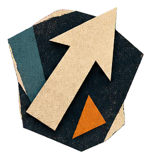

# Constructivist Paper CAI

A Codex skill for turning a theme, object, story, interface brief, campaign idea, or reference image into a tactile Constructivist paper sci-fi visual and a generated raster image.

The callable skill name is `constructivist-paper-cai`.

## Visual Direction

The skill translates each request into a structured paper-collage composition with:

- a deep navy-black paper field
- angular figures and objects built from fibrous paper planes
- warm bone-white forms and typography
- one dominant rusty-vermilion event or symbol
- restrained teal, slate-blue, dusty-purple, and orange accents
- diagonals, wedges, broken circles, orbital rules, and purposeful negative space
- torn edges, folds, photocopy grain, screen-print misregistration, and subtle layer shadows
- a cold, cerebral, archival, and retro-futurist atmosphere

It avoids glossy 3D rendering, generic neon cyberpunk, bright Pop Art, cute cartoon proportions, corporate flat illustration, unreadable typography, and direct imitation of a specific historical poster or living artist.

## Examples

| Upgrade Arrow | Combo Multiplier |
| --- | --- |
|  |  |

| Archive Box | Publication Badge |
| --- | --- |
|  |  |

| Scientist Target Marker |
| --- |
|  |

## Installation

Clone the public repository directly into the Codex skills directory:

```bash
git clone https://github.com/YOUR_USERNAME/constructivist-paper-cai.git \
  ~/.codex/skills/constructivist-paper-cai
```

Replace `QundaiCai314` with the GitHub account or organization that owns the repository. Restart Codex if the skill does not appear immediately.

## Usage

Invoke the skill by name and provide a subject or creative brief:

```text
用 $constructivist-paper-cai 做一张关于太空档案馆的构成主义纸片科幻海报
```

You can also provide a sentence, object, story, campaign idea, interface brief, or reference image.

## Output

For every generation request, the skill returns:

1. the generated raster visual
2. the final image-generation prompt
3. the verified file path and pixel dimensions

The workflow generates the visual by default and only stops at prompt-only output when the user explicitly requests it.

## Repository Structure

- `SKILL.md`: the complete Codex skill instructions
- `README.md`: public overview and installation instructions
- `agents/`: Codex interface metadata
- `references/`: the style guide, prompt patterns, and visual-example guidance
- `examples/`: selected Constructivist paper sci-fi reference images
- `MANIFEST.sha256`: SHA-256 checksums for integrity verification


